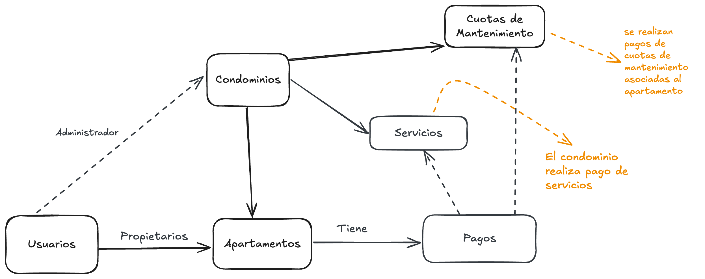

# Condominio App

**Condominio App** es una aplicación para la gestión de condominios, que incluye funcionalidades como cuotas de mantenimiento, servicios comunes, pagos, y más.

## Tabla de Contenidos

- [Requisitos](#requisitos)
- [Instalación](#instalación)
- [Variables de Entorno](#variables-de-entorno)
- [Comandos Disponibles](#comandos-disponibles)
- [Estructura del Proyecto](#estructura-del-proyecto)
- [Endpoints](#endpoints)
  - [Cuotas de Mantenimiento](#cuotas-de-mantenimiento)
  - [Servicios Comunes](#servicios-comunes)
  - [Pagos](#pagos)
- [Contribuciones](#contribuciones)
- [Licencia](#licencia)


---



---

## Requisitos

Antes de comenzar, asegúrate de tener instalados los siguientes requisitos:

- [Node.js](https://nodejs.org/) (versión 16 o superior)
- [npm](https://www.npmjs.com/) o [yarn](https://yarnpkg.com/)
- [MongoDB](https://www.mongodb.com/) (base de datos)


---

## Instalación

1. Clona este repositorio:
   ```bash
   git clone https://github.com/tu-usuario/condominio-app.git
   cd condominio-app
   ```

2. Instala las dependencias:
   ```bash
   npm install
   ```

3. Configura las variables de entorno (ver [Variables de Entorno](#variables-de-entorno)).

4. Inicia la aplicación en modo desarrollo:
   ```bash
   npm run start:dev
   ```

5. La aplicación estará disponible en: `http://localhost:3000`.

---

## Variables de Entorno

Crea un archivo `.env` en la raíz del proyecto con las siguientes variables:

```env
# Configuración del servidor
PORT=3000

# Configuración de la base de datos
MONGO_URI=mongodb://localhost:27017/condominio-app

# Configuración de autenticación
JWT_SECRET=tu_secreto_jwt
JWT_EXPIRATION=3600

# Otros
DEFAULT_LIMIT=10
```

---

## Comandos Disponibles

- **Iniciar la aplicación en modo desarrollo**:
  ```bash
  npm run start:dev
  ```

- **Iniciar la aplicación en modo producción**:
  ```bash
  npm run start:prod
  ```

- **Ejecutar pruebas**:
  ```bash
  npm run test
  ```

- **Ejecutar pruebas con cobertura**:
  ```bash
  npm run test:cov
  ```

---

## Estructura del Proyecto

```plaintext
src/
├── auth/                  # Módulo de autenticación
├── common/                # Servicios y utilidades compartidas
├── condominium/           # Gestión de condominios
├── maintenance_fees/      # Gestión de cuotas de mantenimiento
├── payments/              # Gestión de pagos
├── monthly-statement/     # Estados de cuenta mensuales
├── common-services/       # Servicios comunes del condominio
├── app.module.ts          # Módulo principal
├── main.ts                # Punto de entrada de la aplicación
```

---

## Endpoints

### **Cuotas de Mantenimiento**

- **Crear una cuota de mantenimiento**
  ```http
  POST /api/v1/condominiums/:condominiumId/maintenance-fees
  ```

- **Obtener todas las cuotas de mantenimiento**
  ```http
  GET /api/v1/condominiums/:condominiumId/maintenance-fees
  ```

- **Actualizar una cuota de mantenimiento**
  ```http
  PATCH /api/v1/condominiums/:condominiumId/maintenance-fees/:maintenanceFeeId
  ```

- **Eliminar una cuota de mantenimiento**
  ```http
  DELETE /api/v1/condominiums/:condominiumId/maintenance-fees/:maintenanceFeeId
  ```

---

### **Servicios Comunes**

- **Crear un servicio común**
  ```http
  POST /api/v1/condominiums/:condominiumId/common-services
  ```

- **Obtener todos los servicios comunes**
  ```http
  GET /api/v1/condominiums/:condominiumId/common-services
  ```

- **Actualizar un servicio común**
  ```http
  PATCH /api/v1/condominiums/:condominiumId/common-services/:commonServiceId
  ```

- **Eliminar un servicio común**
  ```http
  DELETE /api/v1/condominiums/:condominiumId/common-services/:commonServiceId
  ```

---

### **Pagos**

- **Crear un pago**
  ```http
  POST /api/v1/condominiums/:condominiumId/payments
  ```

- **Obtener todos los pagos**
  ```http
  GET /api/v1/condominiums/:condominiumId/payments
  ```

- **Actualizar un pago**
  ```http
  PATCH /api/v1/condominiums/:condominiumId/payments/:paymentId
  ```

- **Eliminar un pago**
  ```http
  DELETE /api/v1/condominiums/:condominiumId/payments/:paymentId
  ```

---

## Contribuciones

¡Las contribuciones son bienvenidas! Si deseas contribuir, por favor sigue estos pasos:

1. Haz un fork del repositorio.
2. Crea una rama para tu funcionalidad (`git checkout -b feature/nueva-funcionalidad`).
3. Realiza tus cambios y haz un commit (`git commit -m 'Agrega nueva funcionalidad'`).
4. Haz un push a tu rama (`git push origin feature/nueva-funcionalidad`).
5. Abre un Pull Request.

---

## Licencia

Este proyecto está bajo la licencia **MIT**. Consulta el archivo [LICENSE](LICENSE) para más detalles.